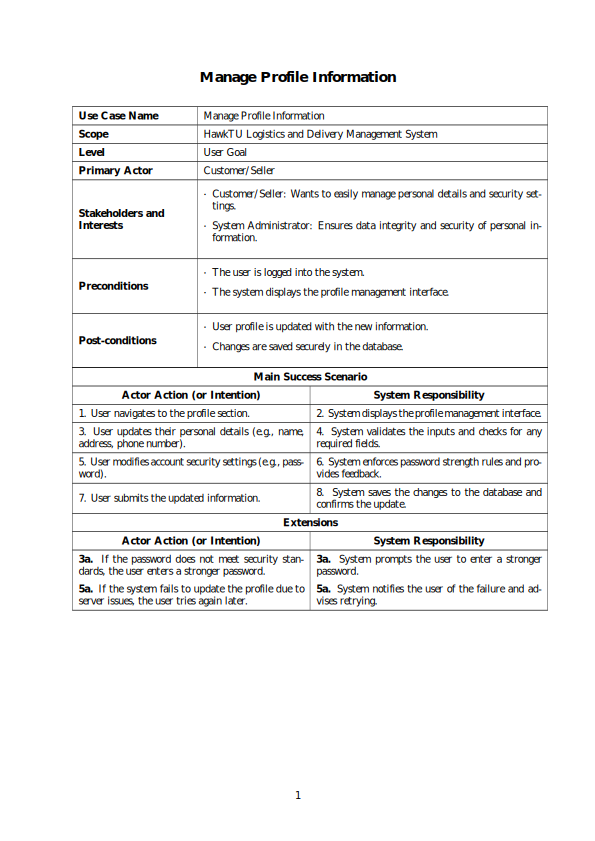
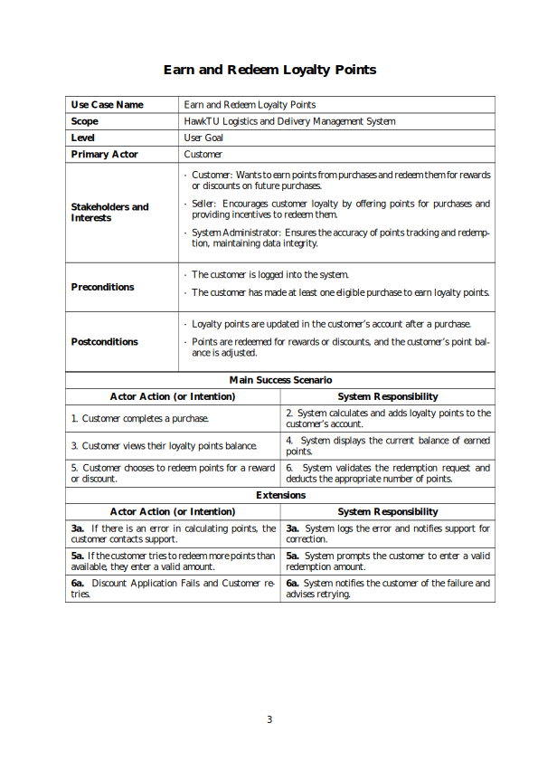
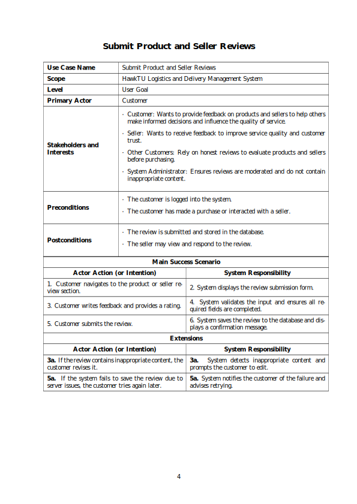
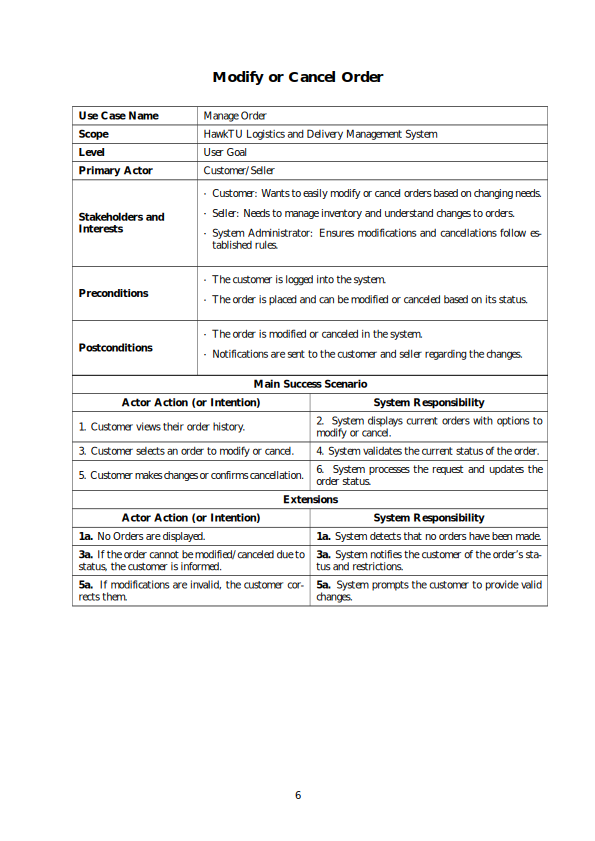
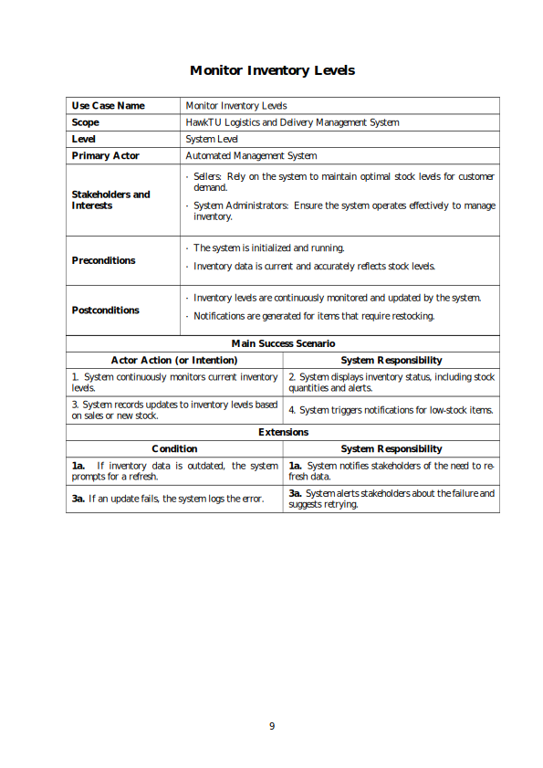
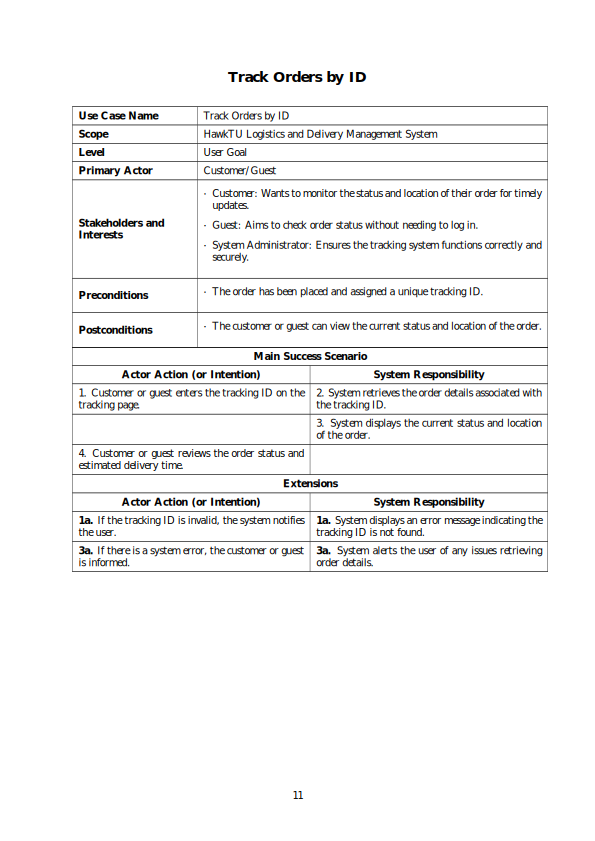
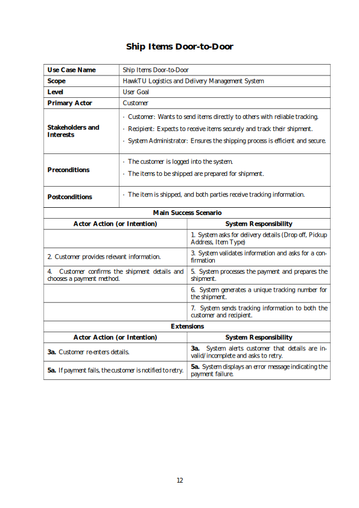

# Fully Dressed Use Cases

Below are the fully dressed use cases for the project. Each page from the pdf is presented as an SVG for better readability and accessibility through this file.

---

